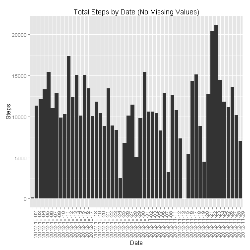
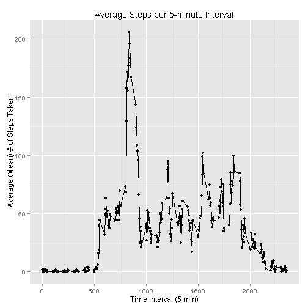
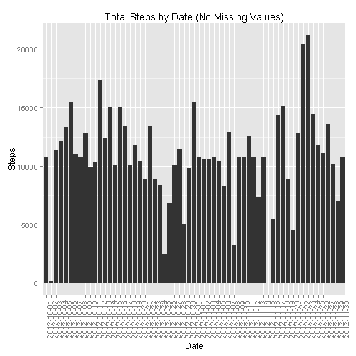
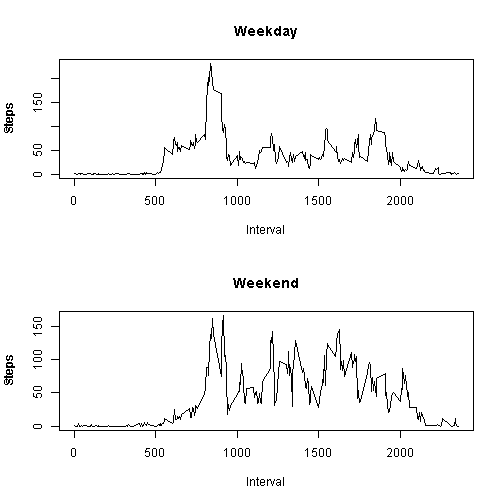

### Reproducible Research: Peer Assignment 1
By: Houtsin Diep

github repo with RMarkdown source code: 
https://github.com/houtsind/RepData_PeerAssessment1/blob/master/PA1_template.Rmd

## Loading and preprocessing the data

1. Load the data 

```
#download the raw data file
temp <- tempfile()
download.file("https://d396qusza40orc.cloudfront.net/repdata%2Fdata%2Factivity.zip", temp)
unlink(temp)
# reading in the data
unzip("repdata-data-activity.zip")
```


```r
pa1.raw.data <- read.csv("activity.csv")
```

2. Process/transform the data (if necessary) into a format suitable for your 
analysis

The date and time were merged into one field and converted.


```r
pa1.date <- as.Date(pa1.raw.data$date, format = "%Y-%m-%d")
pa1.time <- sprintf("%04d", pa1.raw.data$interval)
date.time <- strptime(paste(pa1.date, pa1.time), format = "%Y-%m-%d %H%M")

pa1.time.series <- data.frame(date.time, pa1.raw.data$steps)
colnames(pa1.time.series) <- c("date.time", "steps")

pa1.data.time <- data.frame(pa1.time, pa1.raw.data$steps)
colnames(pa1.data.time) <- c("time", "steps")
```

## What is mean total number of steps taken per day?

1. Make a histogram of the total number of steps taken each day

Using ggplot2, the total number of steps per day was aggregated and graphed as
shown below.


```r
pa1.steps.date <- aggregate(steps ~ date, data = pa1.raw.data, sum)
#barplot(pa1.steps.date$steps, names.arg = pa1.steps.date$date, xlab = "Date", ylab = "Steps", main = "Total Steps by Day")

library(ggplot2)
ggplot(pa1.steps.date, aes(x=date, y=steps)) + 
        geom_histogram(stat = "identity") + 
        theme(axis.text.x = element_text(angle = 90, hjust = 1)) +
        xlab("Date") +
        ylab("Steps") +
        labs(title="Total Steps by Date (No Missing Values)")
```

 

2. Calculate and report the mean and median total number of steps taken per day

The mean and median of steps per date are calculated below.


```r
#mean # of steps
mean(pa1.steps.date$steps)
```

```
## [1] 10766
```

```r
#median # of steps
median(pa1.steps.date$steps)
```

```
## [1] 10765
```

Note: As per the instructions, the missing values were ignored for this portion 
of the assignment.

## What is the average daily activity pattern?

1. Make a time series plot (i.e. type = "l") of the 5-minute interval (x-axis) 
and the average number of steps taken, averaged across all days (y-axis)

Used ggplot2 to graph a line plot for the 5-minutes interval averaged across all 
days.


```r
library(plyr)
pa1.time.mean <- ddply(pa1.data.time, .(interval=time), summarize, mean_value = mean(steps, na.rm=TRUE))

ggplot(pa1.time.mean, aes(x=as.numeric(as.character(interval)), y=mean_value)) +
        geom_point() +
        geom_line() +
        ylab("Average (Mean) # of Steps Taken") +
        xlab("Time Interval (5 min)") +
        labs(title = "Average Steps per 5-minute Interval")
```

 

```r
        scale_x_continuous(breaks = seq (0,2880,by=480))
```

```
## continuous_scale(aesthetics = c("x", "xmin", "xmax", "xend", 
##     "xintercept"), scale_name = "position_c", palette = identity, 
##     breaks = ..1, expand = expand, guide = "none")
```

2. Which 5-minute interval, on average across all the days in the dataset, 
contains the maximum number of steps?

Sort the data in descending to obtain interval with highest average number of 
steps.


```r
head(arrange(pa1.time.mean,desc(mean_value)),1)
```

```
##   interval mean_value
## 1     0835      206.2
```

## Imputing missing values

1. Calculate and report the total number of missing values in the dataset 
(i.e. the total number of rows with NAs)


```r
sum(is.na(pa1.raw.data$steps))
```

```
## [1] 2304
```

2. Devise a strategy for filling in all of the missing values in the dataset. 
The strategy does not need to be sophisticated. For example, you could use the 
mean/median for that day, or the mean for that 5-minute interval, etc.

The mean for each 5-minute interval will be used to fill in any values that are 
NA.


```r
pa1.steps.interval <- aggregate(steps ~ interval, pa1.raw.data, mean)

pa1.data2 <- merge(pa1.raw.data, pa1.steps.interval, by="interval")
pa1.data2.isNAindex <- is.na(pa1.data2$steps.x)
pa1.data2$steps.x[pa1.data2.isNAindex] <- pa1.data2$steps.y[pa1.data2.isNAindex]
```

3. Create a new dataset that is equal to the original dataset but with the 
missing data filled in.

Carry over key columns to final data frame.


```r
pa1.data2 <- pa1.data2[,1:3]
colnames(pa1.data2)[2] <- "steps"
```

4. Make a histogram of the total number of steps taken each day and Calculate 
and report the mean and median total number of steps taken per day. Do these 
values differ from the estimates from the first part of the assignment? What is 
the impact of imputing missing data on the estimates of the total daily number 
of steps?

Aggregate the data end plot using ggplot2 as a histogram.


```r
pa1.data2.steps.date <- aggregate(steps ~ date, pa1.data2, sum)

ggplot(pa1.data2.steps.date, aes(x=date, y=steps)) + 
        geom_histogram(stat = "identity") + 
        theme(axis.text.x = element_text(angle = 90, hjust = 1)) +
        xlab("Date") +
        ylab("Steps") +
        labs(title="Total Steps by Date (No Missing Values)")
```

 

Calculated the mean and median of the data set with NA values filled in, at an 
aggregate level, it does not appear to make a large difference.


```r
# mean
round(mean(pa1.data2.steps.date$steps))
```

```
## [1] 10766
```

```r
# median
round(median(pa1.data2.steps.date$steps))
```

```
## [1] 10766
```

## Are there differences in activity patterns between weekdays and weekends?

1. Create a new factor variable in the dataset with two levels - "weekday" and 
"weekend" indicating whether a given date is a weekday or weekend day.

Simple function to check weekend and assign all others to weekday. Created
factor column.


```r
pa1.data3.steps.date<- cbind(pa1.data2.steps.date,day="")

day <- function(date) {
        if(weekdays(as.Date(date)) %in% c("Saturday", "Sunday")) {
                "weekend"
        } else {
                "weekday"
        }
}

pa1.data3 <- pa1.data2
pa1.data3$day <- as.factor(sapply(pa1.data3$date, day))
```

2. Make a panel plot containing a time series plot (i.e. type = "l") of the 
5-minute interval (x-axis) and the average number of steps taken, averaged 
across all weekday days or weekend days (y-axis). 

Plotted two graphs; 1 for weekend, 1 for weekday.


```r
pa1.data3 <- pa1.data3[,c(1:2,4)]

par(mfrow = c(2,1))

pa1.data3p2 <- aggregate(steps ~ interval, data=pa1.data3, subset=pa1.data3$day=="weekday", FUN=mean)
plot(pa1.data3p2, type="l")
title("Weekday", xlab = "Interval", ylab = "Steps")

pa1.data3p2 <- aggregate(steps ~ interval, data=pa1.data3, subset=pa1.data3$day=="weekend", FUN=mean)
plot(pa1.data3p2, type="l")
title("Weekend", xlab = "Interval", ylab = "Steps")
```

 
